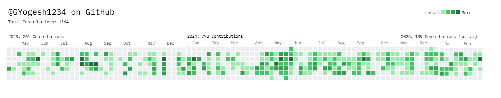

  <h1>Hey, I'm Yogesh Kumar Gupta! 👋</h1>
  

    
    
    
    
  

  
Full Stack Developer crafting intuitive web experiences with React, Angular, and TypeScript.

  
  

    <a href="/Yogesh_CV.pdf" download="Yogesh_CV.pdf">
      <button style="padding: 10px 20px; background-color: #007bff; color: white; border: none; border-radius: 5px; display: inline-flex; align-items: center; justify-content: center; vertical-align: middle;">Download CV</button>
    </a>
  

---

### About Me:
Hi, I’m **Yogesh Kr. Gupta**! I’m a web developer passionate about solving complex problems and building useful applications. I have 3 years of professional experience in **MERN & MEAN STACK** with a strong focus on **frontend development**, working primarily with **Angular**, **TypeScript**, and **React**.

---
### 🛠️ Tech Stack

---
## 👨‍💻 Technical Contributions

I love solving real-world problems through code and improving user experiences with every commit. Here’s a glimpse of my work:

---

### 🏢 Virtual Diamond Boutique (VDB)

- Resolved **250+ Jira tickets** involving bug fixes, UI improvements, and feature additions.
- Architected **3D Jewelry Configurator**, **Notification**, **Cart Checkout**, **sign-up forms** and integrated APIs for seamless onboarding.
### 🟢 Contribution timeline (full year)
🔗 [Check out my VDB GitHub account](https://github.com/GYogesh1234)

  

  

### 🏢 TechBinary (BlueBerry Groups)
 
- Spearheaded development of the **Roadster WebApp**, onboarding brands Bikes like **Bajaj** and **Davido**.
- Resolved critical issues on **BBJ** & **BBT**, improved data fetch time by **200%**, and reduced latency to **0.8s**.
### 🟢 Contribution timeline (full year)
🔗 [Check out my TechBinary GitHub account](https://github.com/Yogesh-techbinary)

  

  

---

### 🌟 Live Projects

#### [GNDiamonds](https://your-gndiamonds-link.com)
*Angular | TypeScript | AWS | Bootstrap*  
- Built search, product, and signup pages for **30+ white-labeled clients**.  
- Optimized UX with infinite scroll and dynamic grids, reducing drop-off rates.  
- Added secure uploads and Material Stepper for seamless signup flow.

#### [SABAN ONYX](https://your-saban-onyx-link.com)
*Angular | TypeScript | AWS | Bootstrap*  
- Developed a 3D jewelry configurator with **12,000+ combinations**, boosting sales by **450%**.  
- Integrated WhatsApp sharing and saved searches for better engagement.  
- Optimized APIs for smooth UI-backend communication.

> **More projects** on my [GitHub Repos](https://github.com/YogeshYKG?tab=repositories)!

---

### 📊 Stats & Achievements

  
  

- 🏆 Certificate from **National Informatics Centre (NIC) of India** for a Full-Stack WebApp
- 🧩 Solved **250+ LeetCode problems** ([View Profile](https://leetcode.com/your-profile))
- ✅ Led **3 developers** to deliver a 3D configurator at VDB

---

### 🎉 Fun Fact
When I'm not coding, you’ll find me exploring Jaipur’s forts or debugging life’s mysteries with a cup of chai! ☕
